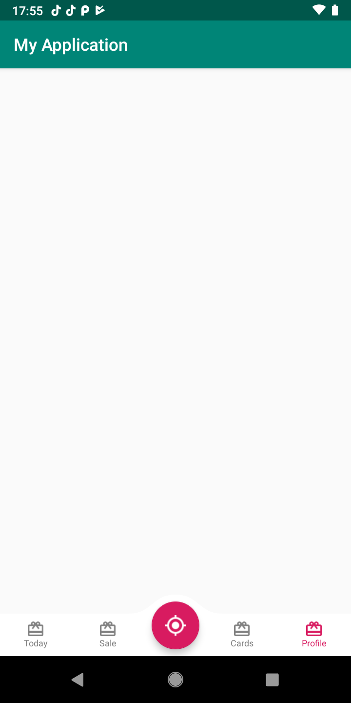


# Space-Navigation-V2 
Space Navigation is a library allowing easily integrate fully customizable Google Spaces like navigation to your app.

[Fork from https://github.com/armcha/Space-Navigation-View] 

**I have converted Space Navigation View from Java to Kotlin**

Some Changes:
1. Remove features Icon and Text on the same line 
2. Put text under icon
3. Migrate to Android X and Kotlin 
4. Mininum SDK 21 - Target 29
5. Replace all of ***Deprecated*** API to news API.

